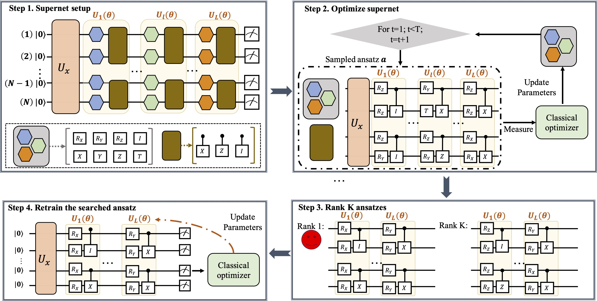
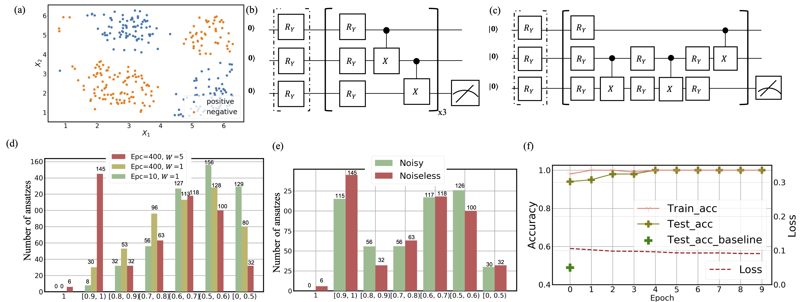
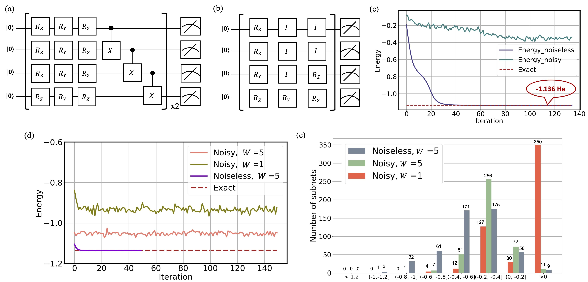

# QAS
This repository includes code in our paper "[Quantum circuit architecture search: error mitigation and trainability enhancement for variational quantum solvers](https://arxiv.org/abs/2010.10217)".

To maximally improve the robustness and trainability of variational quantum algorithms (such as quantum neural networks, variational quantum eigensolvers, and quantum approximate optimization algorithms), here we devise a resource and runtime efficient scheme termed quantum architecture search  (QAS). In particular, given a learning task, QAS automatically seeks a near optimal ansatz (i.e., quantum circuit architecture) to balance benefits and side-effects brought by adding more noisy quantum gates.

Note: To use IBMQ backend, please register an account first. The folder "machine_learning_large_memory" includes the code of dynamically saving trainable paramters when the number of qubits or the circuit depth becomes large.



---

## Requirements
```
pennylane==0.11.0
pennylane-qiskit==0.11.0
qiskit==0.20.1
```

## Baseline results achieved by Hardware-efficient ansatz
* Quantum Machine Learning
  ```shell
  cd machine_learning
  python train.py    # train QNN without noise
  python train.py --noise    # train QNN with noise
  python train.py 10-13-41    # train QNN with the gate arrangement 10-13-41

  ```

* Quantum Chemistry
  ```shell
  cd quantim_chemistry
  python train.py    # train VQE without noise
  python train.py --noise    # train VQE with noise
  python train_search.py 10-13-41    # train VQE with the gate arrangement 10-13-41
  python train_search.py --device ibmq    # train VQE on IBMQ
  python train_search.py --device imbq-sim    # train VQE with IBMQ-simulated noise
  ```

## Simulation results achieved by QAS
* Quantum Machine Learning
  ```shell
  cd machine_learning
  python train_search.py
  python train_search.py --noise    # search ansatz with noise
  python train_search.py --searcher 'evolution' # train QAS and utilize evolutionary algorithms at the ranking state 
  ```
* Quantum Chemistry
  ```shell
  cd quantim_chemistry
  python train_search.py
  python train_search.py --noise    # search ansatz with noise
  python train_search.py --device imbq-sim    # search with IBMQ-simulated noise
  python train_search.py --searcher 'evolution' # train QAS and utilize evolutionary algorithms at the ranking state 
  ```
---
## Experiment results
* Quantum Machine Learning



(a) The illustration of some examples in D with first two features. (b) The implementation of the quantum kernel classifier for benchmarking. The quantum gates highlighted by dashed box refer to the encoding layer that transforms the classical input x^{(i)} into the quantum state. The quantum gates located in the solid box refer to the block U_l(\theta). (c) The output ansatz of QAS under the noisy setting. (d) The validation accuracy of QAS under the noiseless case. The label "Epc=a, W =b" represents that the number of epochs and supernets is T=a and W=b, respectively. The x-axis means that the validation accuracy of the sampled ansatz is in the range of [c,d), e.g., c=0.5, and d=0.6. (e) The comparison of QAS between the noiseless and noisy cases. The hyper-parameters setting for both cases is T=400, K=500, and W=5. The meaning of x-axis is identical to the subfigure (c). (f) The performance of the quantum kernel classifier (labeled by "Test_acc_baseline") and QAS (labeled by "Train/Test_acc") at the fine tuning stage under the noisy setting.

* Quantum Chemistry



(a) The implementation of VQE with the hardware-efficient ansatz. (b) The output ansatz of QAS under the noisy setting. (c) The training performance of VQE under the noisy and noiseless settings. The label "Exact" refers to the accurate ground state energy E_m for Hydrogen. (d) The performance of QAS under both the noisy and noiseless settings. (e) The performance of QAS at the ranking state. The label "W=b" refers to the number of supernets, i.e., W=b. The x-axis means that the estimated energy of the sampled ansatz is in the range of (c,d], e.g., c=-0.6 Ha, and  d=-0.8 Ha. 

---

## Citation
If you find our code useful for your research, please consider citing it:
```
@article{du2020quantum,
  title={Quantum circuit architecture search: error mitigation and trainability enhancement for variational quantum solvers},
  author={Du, Yuxuan and Huang, Tao and You, Shan and Hsieh, Min-Hsiu and Tao, Dacheng},
  journal={arXiv preprint arXiv:2010.10217},
  year={2020}
}
```
